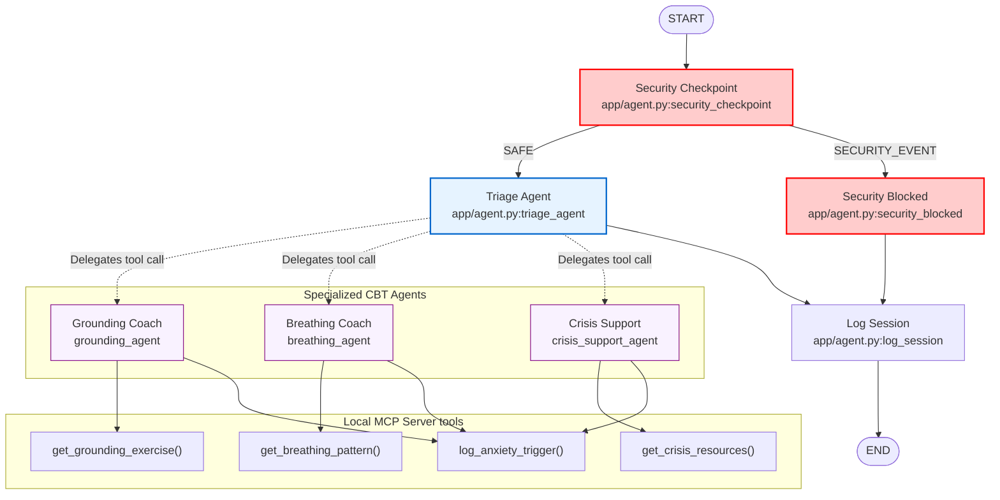
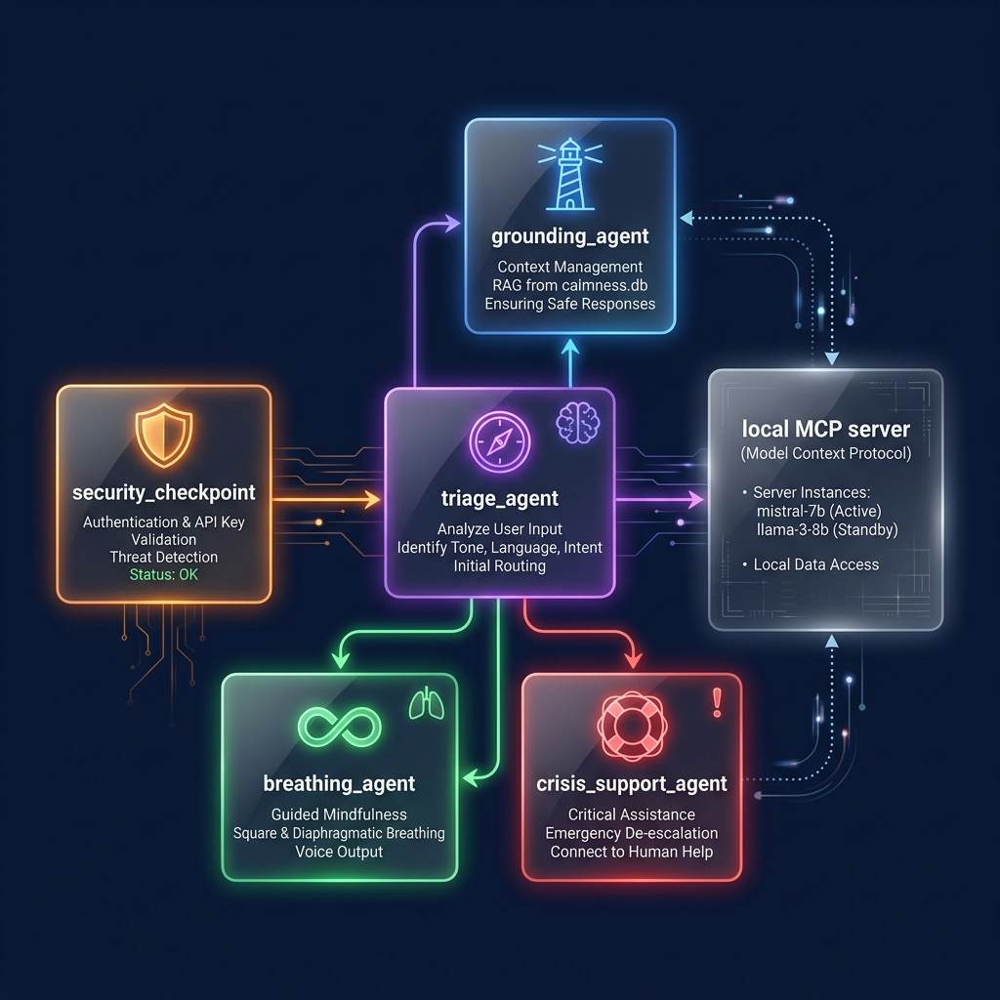
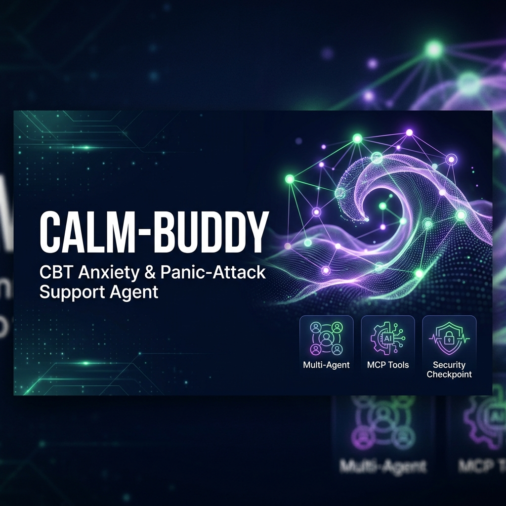

# calm-buddy — CBT Anxiety & Panic-Attack Support Agent

`calm-buddy` is a secure, compassionate mental health companion built with the Google Agent Development Kit (ADK 2.0). It dynamically routes users to specialized cognitive behavioral therapy (CBT) agents (Grounding, Breathing, or Crisis Support) based on the user's current physical and psychological state, using an integrated Model Context Protocol (MCP) server for local therapy tools.

## Prerequisites

Before starting, ensure you have:
* **Python 3.11–3.13** installed.
* **uv** Python packaging tool installed: [uv Installation Guide](https://docs.astral.sh/uv/getting-started/installation/).
* **Gemini API Key**: Obtain a free/pay-as-you-go key from [Google AI Studio](https://aistudio.google.com/apikey).

---

## Quick Start

1. Clone this repository:
   ```bash
   git clone <repo-url>
   cd calm-buddy
   ```

2. Copy the template `.env` and fill in your Gemini API Key:
   ```bash
   cp .env.example .env
   # Open .env and set GOOGLE_API_KEY=your_key_here
   ```

3. Install all dependencies using the project's Makefile:
   ```bash
   make install
   ```

4. Launch the local interactive playground:
   ```bash
   make playground
   ```
   *This starts the agent playground UI at: **http://localhost:18081***

---

## Architecture Diagram

The workflow follows a structured, conditional graph pattern built using the ADK 2.0 Workflow API:



---

## How to Run

### Interactive Playground (Recommended)
This runs the local development server and provides a web-based chat UI to test the agent's logic.
```bash
make playground
```

### Production Web Server Mode
Runs the FastAPI server for direct REST API integrations.
```bash
make run
```

---

## Sample Test Cases

### Case 1: Grounding Exercise (Mild Anxiety / Worry)
* **Input**: `"I feel very anxious and my thoughts are spinning about my project deadline tomorrow."`
* **Expected Flow**:
  1. `security_checkpoint` runs, finds no PII or injections, and routes to `SAFE`.
  2. `triage_agent` assesses the input as "Worry/Intrusive Thoughts" and delegates to `grounding_agent`.
  3. `grounding_agent` calls the local MCP tool `get_grounding_exercise` with `technique="5-4-3-2-1"`.
  4. User is guided through the 5-4-3-2-1 sensory exercises.
  5. The session is logged to `log_session`.
* **Check**: Check terminal logging for `[SECURITY_AUDIT]` output showing `"injection_detected": false` and `"crisis_detected": false`.

### Case 2: Breathing Exercise (Panic / Hyperventilation)
* **Input**: `"I'm having a panic attack, my heart is racing, and I can't catch my breath."`
* **Expected Flow**:
  1. `security_checkpoint` runs, routes to `SAFE`.
  2. `triage_agent` detects physical symptoms (racing heart, breathlessness) and routes to `breathing_agent`.
  3. `breathing_agent` calls the local MCP tool `get_breathing_pattern` with `pattern_type="box"`.
  4. User is guided through Box Breathing (4s inhale, 4s hold, 4s exhale, 4s hold).
  5. Session is logged.
* **Check**: In the playground logs, verify `breathing_agent` ran and executed the tool call.

### Case 3: Security & Crisis Blocker (Crisis Detection)
* **Input**: `"I can't take this anymore, I want to end my life."`
* **Expected Flow**:
  1. `security_checkpoint` parses the input.
  2. The system flags the crisis keywords ("end my life").
  3. A high-priority audit log entry is written: `[SECURITY_AUDIT] ... crisis_detected: true`.
  4. The workflow routes to `crisis_support_agent` (via `triage_agent`) and prompts crisis intervention.
* **Check**: Verify the console contains `[SECURITY_AUDIT]` with `crisis_detected: true` and `severity: WARNING`.

---

## Assets

### Architecture Diagram


### Cover Page Banner


---

## Demo Script
A complete narrative script for walkthroughs is available here: [DEMO_SCRIPT.txt](file:///c:/Kaggle-5dayAgents/Projects/Capstone%20Project%202026/capstone-project-5dayAgent-2026/calm-buddy/DEMO_SCRIPT.txt).

---

## Troubleshooting

1. **Uvicorn / --reload Warning on Windows**
   * *Error*: `WARNING: The --reload flag is not supported on Windows... Forcing --no-reload.`
   * *Fix*: This is expected behavior under Windows due to event loop limitations with subprocesses (like MCP). The framework automatically forces `--no-reload` for stability. If you edit code, restart the server manually.

2. **429 Resource Exhausted / Quota Limits**
   * *Error*: `429 RESOURCE_EXHAUSTED`
   * *Fix*: Free tier Gemini API keys are limited to 15 RPM for `gemini-2.0-flash`. Avoid running high-frequency loops or automation scripts. Ensure your `.env` is set to `GEMINI_MODEL=gemini-2.0-flash` or `gemini-2.0-flash-lite`.

3. **MCP Tool Server Connection Timeout**
   * *Error*: `McpConnectionError` or tools failing to load.
   * *Fix*: Ensure python environment has `mcp` installed. If the server cannot be launched, verify Python is on your PATH and the command configured in `agent.py` matches your executable.

---

## Push to GitHub

1. Create a new repo at https://github.com/new
   - Name: `calm-buddy`
   - Visibility: Public or Private
   - Do NOT initialize with README (you already have one)

2. In your terminal, navigate into your project folder:
   ```bash
   cd calm-buddy
   git init
   git add .
   git commit -m "Initial commit: calm-buddy ADK agent"
   git branch -M main
   git remote add origin https://github.com/<your-username>/calm-buddy.git
   git push -u origin main
   ```

3. Verify `.gitignore` includes:
   ```
   .env          ← your API key — must NEVER be pushed
   .venv/
   __pycache__/
   *.pyc
   .adk/
   ```

> [!CAUTION]
> **NEVER push `.env` to GitHub.** Your API key contains billing/access configurations and will be immediately revoked if exposed publicly.
