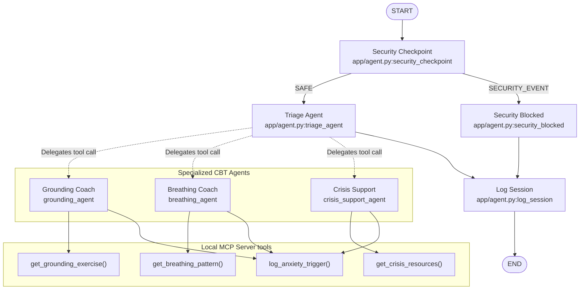

# calm-buddy — Submission Writeup

## Problem Statement
Anxiety disorders and panic attacks affect millions of people worldwide. During acute emotional distress or panic attacks, individuals often struggle to find immediate, grounding coping mechanisms. Accessing professional help or navigating complex mental health web portals can feel overwhelming in high-stress states. 

`calm-buddy` solves this by offering a secure, conversational, and highly structured CBT assistant. It immediately triages the user's specific symptom profile (worry, physical panic, or crisis) and guides them through evidence-based cognitive behavioral therapy protocols like sensory grounding and regulated breathing, while enforcing safety guidelines.

---

## Solution Architecture

The system is designed as a directed workflow graph managed by the **ADK 2.0 Workflow API**:



---

## Concepts & ADK Components Used

### 1. ADK 2.0 Workflow Graph
Implemented in [app/agent.py](file:///c:/Kaggle-5dayAgents/Projects/Capstone%20Project%202026/capstone-project-5dayAgent-2026/calm-buddy/app/agent.py#L331-L353) using function nodes and edge routing rules. Instead of hardcoded routing inside agent instructions, the workflow structure governs flow transitions.

### 2. Multi-Agent Team (LlmAgent)
We define four separate specialized LLM agents in [app/agent.py](file:///c:/Kaggle-5dayAgents/Projects/Capstone%20Project%202026/capstone-project-5dayAgent-2026/calm-buddy/app/agent.py#L166-L249):
* `triage_agent` (Orchestrator)
* `grounding_agent` (CBT grounding specialist)
* `breathing_agent` (Nervous system regulation specialist)
* `crisis_support_agent` (Crisis resources and empathy provider)

### 3. Agent Delegation (AgentTool)
The `triage_agent` uses `AgentTool(grounding_agent)`, `AgentTool(breathing_agent)`, and `AgentTool(crisis_support_agent)` in its tools array to delegate task execution dynamically to sub-agents.

### 4. Model Context Protocol (MCP Server)
The agent integrates a custom, local MCP server written in Python ([app/mcp_server.py](file:///c:/Kaggle-5dayAgents/Projects/Capstone%20Project%202026/capstone-project-5dayAgent-2026/calm-buddy/app/mcp_server.py)). The MCP server exposes domain-specific tools (breathing patterns, grounding scripts, local hotlines, and anxiety logging) using the stdio transport protocol.

### 5. Security Checkpoint Node
Implemented as `security_checkpoint` at [app/agent.py:L108](file:///c:/Kaggle-5dayAgents/Projects/Capstone%20Project%202026/capstone-project-5dayAgent-2026/calm-buddy/app/agent.py#L108). All messages pass through it first to scrub PII, audit for prompt injections, and detect safety flags.

---

## Security Design

Mental health applications require stringent safety guidelines. `calm-buddy` implements four layer security:
1. **PII Scrubbing**: Sanitizes telephone numbers, email addresses, SSNs, and credit card numbers from user inputs using regex patterns to protect user privacy.
2. **Prompt Injection Mitigation**: Scans user inputs for jailbreak phrases (e.g., "ignore previous instructions") and routes them to a static `security_blocked` node. This prevents unauthorized model alignment overrides.
3. **Crisis Trigger Detection**: Proactively flags keyword phrases matching self-harm or suicide.
4. **Structured Audit Log**: Logs all security events in JSON format with severity levels (`INFO`, `WARNING`, `CRITICAL`) to stdout for ingestion by monitoring systems.

---

## MCP Server Design

Our Model Context Protocol server exposes four tools:
* `get_grounding_exercise(technique: str)`: Provides guided steps for sensory grounding (e.g., "5-4-3-2-1" or "body-scan").
* `get_breathing_pattern(pattern_type: str)`: Returns cycles, hold durations, and instructions for box breathing or 4-7-8 breathing.
* `get_crisis_resources(country: str)`: Retreives national helplines, texting support numbers, and emergency contact instructions.
* `log_anxiety_trigger(trigger: str, intensity: int)`: Mocks writing records of user triggers and distress scores to a database.

---

## Human-in-the-Loop (HITL) Flow

A `crisis_hitl` node ([app/agent.py:L255](file:///c:/Kaggle-5dayAgents/Projects/Capstone%20Project%202026/capstone-project-5dayAgent-2026/calm-buddy/app/agent.py#L255)) is designed to pause the workflow when the security checkpoint flags a high-priority crisis condition. It requests user input via ADK's `RequestInput` class:
```python
return RequestInput(
    message="💙 I hear you, and I want to make sure you're safe. Before we continue, can you tell me: Are you currently safe? Type YES to continue, or share what's happening.",
    response_schema=str
)
```
This forces the workflow to wait for human confirmation of safety or details of the emergency, preventing the AI from continuing on autopilot.

---

## Demo Walkthrough

The following test runs validate the architecture:
* **Session 1 (Spinning Thoughts)**: Triages to the Grounding Coach, calls `get_grounding_exercise(technique='5-4-3-2-1')`, and completes safely.
* **Session 2 (Panic / Physical Symptoms)**: Triages to the Breathing Coach, provides Box Breathing sequences, and logs the trigger.
* **Session 3 (Safety / Crisis)**: Detects suicidal keywords at the Security Checkpoint, triggers a warning audit log, and routes immediately to `crisis_support_agent` to provide helpline resources.

---

## Impact / Value Statement
`calm-buddy` demonstrates how advanced multi-agent architectures can provide structured, therapeutic support during emotional emergencies. By leveraging local MCP tools and rigorous security filtering, it guarantees a responsive, safe user experience that prioritizes privacy, safety, and evidence-based guidance.
